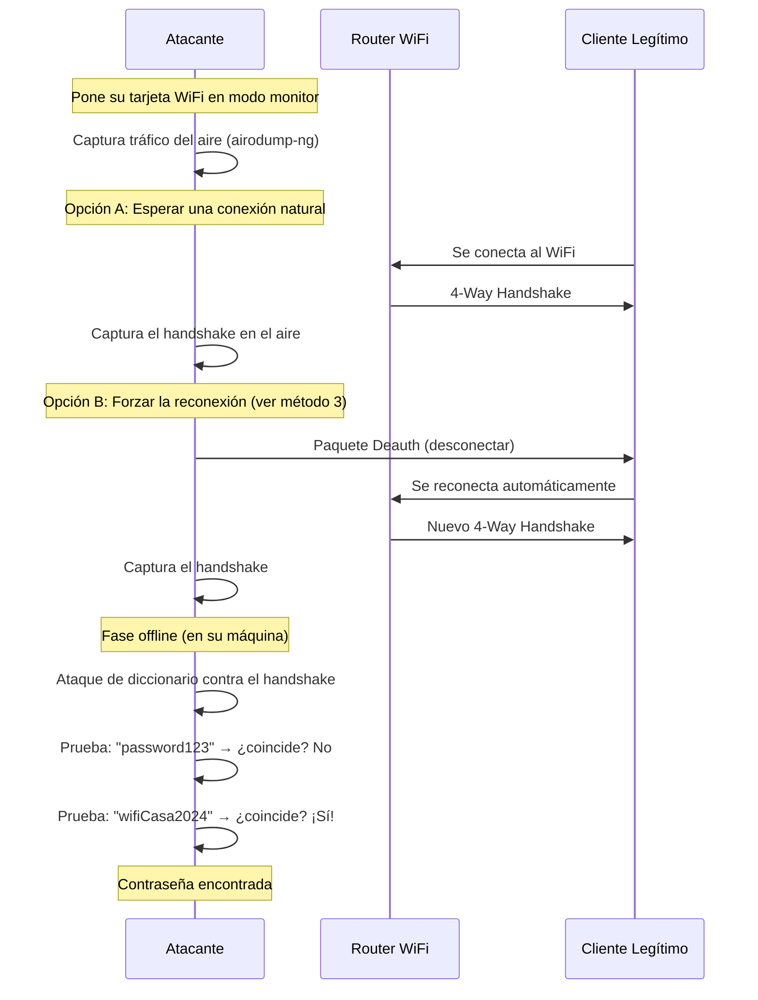
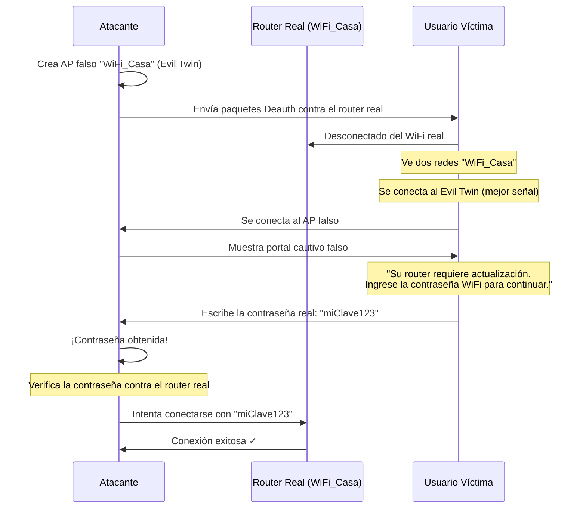
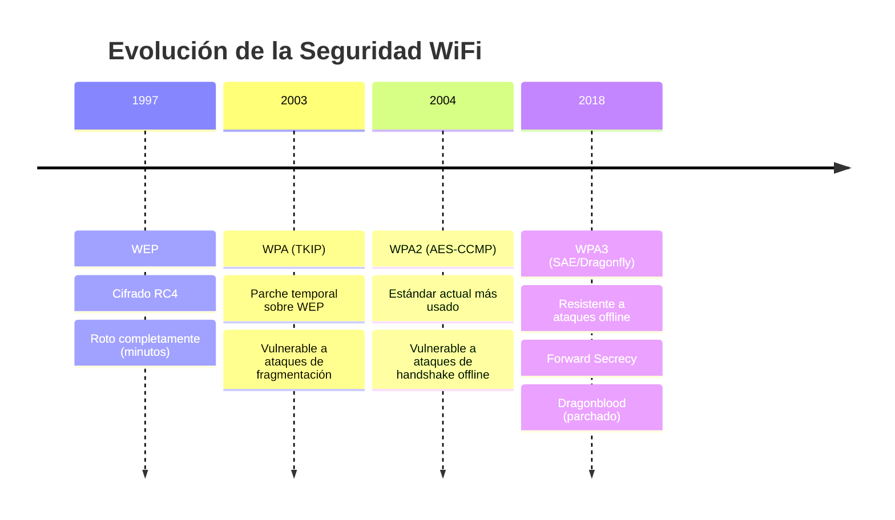

# Métodos de Ataque a Redes WiFi

Documento de referencia sobre los métodos actuales utilizados en auditorías de seguridad para obtener acceso a redes WiFi protegidas.

---

## Tabla de Contenidos

- [Resumen de Métodos](#resumen-de-métodos)
- [1. Captura de Handshake + Fuerza Bruta Offline](#1-captura-de-handshake--fuerza-bruta-offline)
- [2. Ataque PMKID](#2-ataque-pmkid)
- [3. Ataque de Deautenticación](#3-ataque-de-deautenticación)
- [4. Evil Twin / Gemelo Malvado](#4-evil-twin--gemelo-malvado)
- [5. Ataque WPS Pin](#5-ataque-wps-pin)
- [6. WPA3 y Dragonblood](#6-wpa3-y-dragonblood)
- [7. Buffer Overflow en Firmware](#7-buffer-overflow-en-firmware)
- [Protocolos WiFi a Través del Tiempo](#protocolos-wifi-a-través-del-tiempo)

---

## Resumen de Métodos

| Método | Dificultad | ¿Rompe la contraseña? | Efectividad actual |
|--------|-----------|----------------------|-------------------|
| Handshake + Diccionario | Media | Sí (si es débil) | ⭐⭐⭐⭐⭐ |
| PMKID | Media | Sí (si es débil) | ⭐⭐⭐⭐ |
| Evil Twin | Media | No (engaño social) | ⭐⭐⭐⭐ |
| Deautenticación | Fácil | No (auxiliar) | ⭐⭐⭐⭐ |
| WPS Pin | Fácil | Sí | ⭐⭐ (obsoleto) |
| Buffer Overflow | Muy alta | Sí (bypass total) | ⭐ (muy raro) |

---

## 1. Captura de Handshake + Fuerza Bruta Offline

**El método más clásico y más utilizado contra redes WPA/WPA2.**

### ¿Cómo funciona?

Cuando un dispositivo se conecta a un router WiFi, ambos realizan un intercambio criptográfico llamado **4-Way Handshake** para verificar que la contraseña es correcta sin transmitirla directamente.

El flujo del ataque es:



### Detalles técnicos

- El handshake NO contiene la contraseña en texto plano.
- Contiene valores derivados criptográficamente (hashes) que permiten **verificar** si una contraseña candidata es correcta.
- El atacante prueba millones de contraseñas por segundo contra estos hashes, usando su CPU/GPU.
- **Herramientas:** `aircrack-ng` (captura + cracking), `hashcat` (cracking con GPU, mucho más rápido).
- **Diccionarios comunes:** `rockyou.txt` (~14 millones de contraseñas filtradas de brechas reales).

### Limitaciones

- Si la contraseña es fuerte y aleatoria (ej. `X#8kL!m9@pQr`), este método **no la rompe**.
- Requiere una tarjeta WiFi que soporte **modo monitor** (no todas lo soportan).
- Modelos populares que soportan modo monitor: Alfa AWUS036ACH, TP-Link TL-WN722N (v1).

---

## 2. Ataque PMKID

**Descubierto en 2018. Evolución del método de handshake.**

### ¿Cómo funciona?

- En el método clásico (1), necesitas esperar a que un cliente se conecte al WiFi para capturar el handshake.
- Con PMKID, el atacante envía una **solicitud de asociación** directamente al router.
- El router responde con un hash llamado **PMKID** (Pairwise Master Key Identifier).
- Este hash contiene suficiente información para hacer cracking offline, igual que el handshake completo.

### Ventaja clave

**No necesita que haya clientes conectados.** Puedes atacar un router WiFi que esté encendido pero sin ningún dispositivo asociado.

```
Método Clásico:  Atacante ──► espera ──► Cliente se conecta ──► captura handshake
Método PMKID:    Atacante ──► solicita asociación al router ──► recibe PMKID ──► cracking
```

### Detalles técnicos

- **Herramientas:** `hcxdumptool` (captura PMKID), `hashcat -m 22000` (cracking).
- Funciona contra WPA/WPA2 con roaming habilitado (802.11r).

### Limitaciones

- No todos los routers responden con PMKID (depende del fabricante y firmware).
- Sigue dependiendo de que la contraseña sea débil para el cracking offline.

---

## 3. Ataque de Deautenticación

**No rompe la contraseña. Es una herramienta auxiliar para otros ataques.**

### ¿Cómo funciona?

El protocolo WiFi (802.11) tiene frames de gestión (*management frames*) que controlan la conexión. Uno de ellos es el frame **Deauthentication**, que le dice a un dispositivo: *"has sido desconectado"*.

El problema es que en WPA2 estos frames **no están autenticados** — cualquiera puede enviarlos.

```
Atacante envía:
┌─────────────────────────────────┐
│ Frame Deauth (falsificado)      │
│ From: Router (dirección MAC)    │
│ To:   Cliente (dirección MAC)   │
│ Reason: "Inactivity"           │
└─────────────────────────────────┘
         │
         ▼
Cliente: "El router me desconectó" → Se reconecta → Genera handshake
```

### Usos en ataques

1. **Forzar un handshake** para capturarlo (complemento del método 1).
2. **Denegación de servicio (DoS):** Enviar deauths continuamente para que nadie pueda usar la red.
3. **Preparar un Evil Twin** (método 4): Desconectar a todos de la red real para que se conecten a la falsa.

### Detalles técnicos

- **Herramientas:** `aireplay-ng --deauth`, `mdk3`, `mdk4`.
- **Protección:** WPA3 introduce **Protected Management Frames (PMF / 802.11w)** que firma estos frames criptográficamente, impidiendo su falsificación.

---

## 4. Evil Twin / Gemelo Malvado

**Ataque de ingeniería social que no rompe la contraseña, sino que engaña al usuario para que la entregue.**

### ¿Cómo funciona?



### Flujo detallado

1. El atacante crea un punto de acceso WiFi con el **mismo nombre (SSID)** que la red objetivo.
2. Lanza un ataque de deautenticación (método 3) contra la red real.
3. Los dispositivos se desconectan y ven dos redes con el mismo nombre.
4. Algunos dispositivos (o el usuario manualmente) se conectan al Evil Twin.
5. El atacante muestra una **página web falsa** que solicita la contraseña WiFi.
6. El usuario, creyendo que es legítimo, ingresa la contraseña.

### Detalles técnicos

- **Herramientas:** `Fluxion` (automatiza todo el proceso), `wifiphisher`, `hostapd` + `dnsmasq` (manual).

### Limitaciones

- Requiere que el usuario caiga en el engaño (ingeniería social).
- Usuarios técnicos o cautelosos lo detectarán.
- Algunos sistemas operativos modernos muestran advertencias al conectarse a redes abiertas.

---

## 5. Ataque WPS Pin

**Casi obsoleto, pero aún presente en routers antiguos.**

### ¿Cómo funciona?

Muchos routers tienen una función llamada **WPS (WiFi Protected Setup)** que permite conectarse con un PIN de 8 dígitos en lugar de la contraseña completa.

La vulnerabilidad radica en cómo se valida el PIN:

```
PIN WPS:  1234  5678  (8 dígitos)
            │       │
            ▼       ▼
Validación: Primera mitad se valida primero (10,000 combinaciones)
            Luego la segunda mitad (1,000 combinaciones + 1 checksum)
            
Total: 10,000 + 1,000 = 11,000 intentos (en lugar de 100,000,000)
```

### Detalles técnicos

- **Herramientas:** `reaver`, `bully`.
- El ataque toma entre 2 y 10 horas dependiendo del router.

### Limitaciones

- La mayoría de routers modernos tienen WPS deshabilitado por defecto.
- Muchos implementan **rate-limiting** (bloqueo tras varios intentos fallidos).
- Algunos detectan el ataque y desactivan WPS automáticamente.

---

## 6. WPA3 y Dragonblood

**WPA3 fue diseñado para solucionar las debilidades de WPA2, pero no es perfecto.**

### Mejoras de WPA3 sobre WPA2

| Característica | WPA2 | WPA3 |
|---------------|------|------|
| Handshake | 4-Way (PSK) | SAE (Dragonfly) |
| Resistencia a diccionario offline | ❌ No | ✅ Sí |
| Forward Secrecy | ❌ No | ✅ Sí |
| Management Frames protegidos | Opcional | Obligatorio |

### Vulnerabilidades Dragonblood (2019)

A pesar de las mejoras, en 2019 investigadores descubrieron varias vulnerabilidades en el handshake SAE:

1. **Side-Channel Attacks (Timing):** Analizando los tiempos de respuesta del router durante el handshake SAE, se puede filtrar información parcial sobre la contraseña. Combinando múltiples mediciones, se puede reducir el espacio de búsqueda.

2. **Downgrade Attacks:** Si el router soporta tanto WPA2 como WPA3 (modo transición), el atacante puede forzar a los clientes a conectarse usando WPA2, anulando las protecciones de WPA3.

### Estado actual

- La mayoría de las vulnerabilidades Dragonblood fueron parchadas.
- WPA3 sigue siendo significativamente más seguro que WPA2.
- La adopción de WPA3 es lenta; la mayoría de redes aún usan WPA2.

---

## 7. Buffer Overflow en Firmware

**El más avanzado y raro. Ataques de nivel 0-day.**

### ¿Cómo funciona?

En lugar de atacar la contraseña o el protocolo, se ataca directamente el **software del router** (firmware).

- Si el firmware tiene un bug en cómo procesa ciertos paquetes de red (por ejemplo, un campo de longitud no validado), un atacante puede enviar un paquete especialmente diseñado que desborda la memoria del router.
- Esto puede permitir **ejecutar código arbitrario** en el router, obteniendo acceso total sin conocer la contraseña.

### Ejemplo real: KRACK Attack (2017)

- **Key Reinstallation Attack** explotó una debilidad lógica en la implementación del 4-Way Handshake de WPA2.
- No era un buffer overflow per se, sino un fallo de lógica que permitía reinstalar claves de cifrado ya usadas.
- Afectó prácticamente a todos los dispositivos WiFi del mundo.

### Otros ejemplos

- **FragAttacks (2021):** Vulnerabilidades en la fragmentación de frames WiFi que afectaban a todos los protocolos (WEP, WPA, WPA2, WPA3).
- **CVEs específicos de routers:** Bugs en interfaces web de administración de marcas como TP-Link, Netgear, D-Link que permiten ejecución remota de código.

### Limitaciones

- Requiere conocimiento avanzado de ingeniería inversa y explotación de binarios.
- Son ataques **específicos** para un modelo/versión de firmware.
- Los fabricantes parchean rápidamente las vulnerabilidades publicadas.

---

## Protocolos WiFi a Través del Tiempo



| Protocolo | Año | Cifrado | Estado actual |
|-----------|-----|---------|---------------|
| WEP | 1997 | RC4 | ☠️ Roto. Se crackea en minutos. |
| WPA | 2003 | TKIP | ⚠️ Obsoleto. Vulnerable. |
| WPA2 | 2004 | AES-CCMP | ⚡ El más usado. Atacable con handshake capture. |
| WPA3 | 2018 | AES-GCMP / SAE | ✅ El más seguro. Adopción creciente. |

---

> **Nota:** Esta documentación es de carácter educativo. Realizar cualquiera de estos ataques contra redes sin autorización explícita del propietario es ilegal y está penalizado en la mayoría de países.
